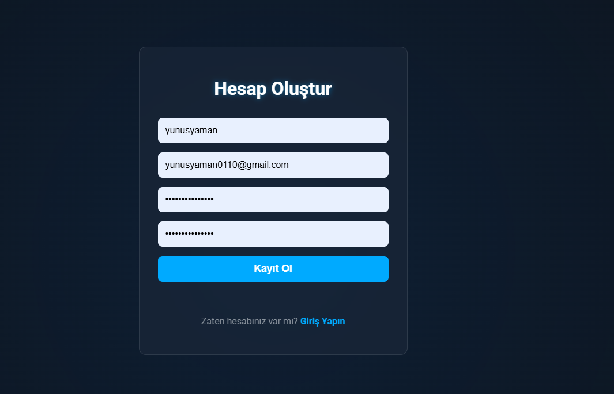
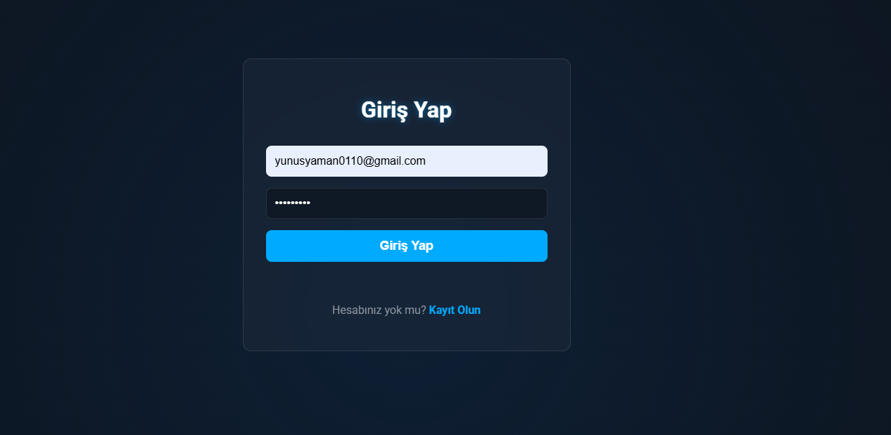
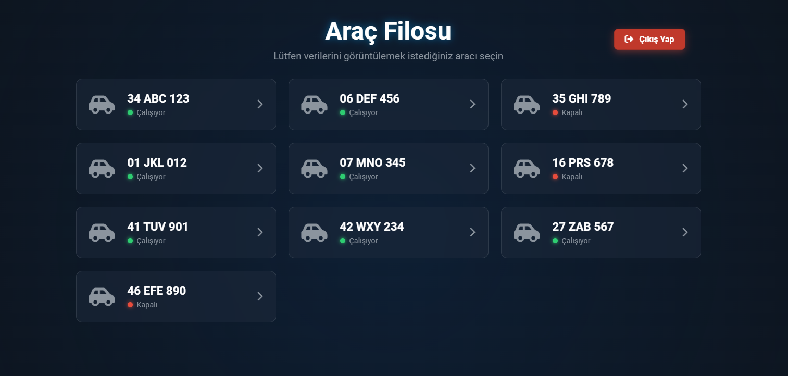
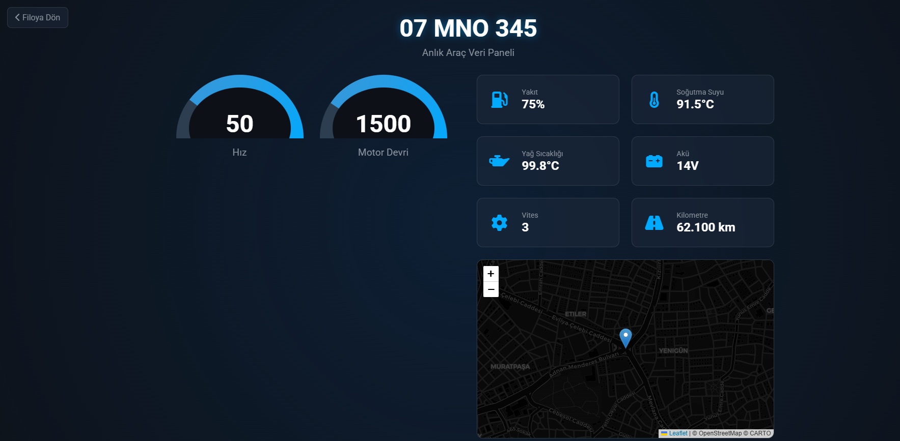

# CAN BUS Araç Veri Paneli


Bu proje, bir araç filosundan gelen CAN BUS verilerini simüle eden, bu verileri güvenli bir API üzerinden sunan ve modern bir web arayüzünde görselleştiren tam teşekküllü bir web uygulamasıdır.

## Ekran Görüntüleri

*Projenizin çalışan halinden ekran görüntüleri alıp `screenshots` adında bir klasör oluşturarak içine ekleyebilirsiniz.*

| Kayıt Ekranı | Giriş Ekranı |
| :---: | :---: |
|  |  |

| Araç Filo Listesi | Araç Detay Paneli |
| :---: | :---: |
|  |  |


## Özellikler

- **Kullanıcı Yönetimi:** Güvenli kullanıcı kayıt ve giriş sistemi.
- **JWT Kimlik Doğrulama:** API uç noktaları, JSON Web Token (JWT) ile korunmaktadır.
- **RESTful API:** Django Rest Framework ile oluşturulmuş, araç verilerini sunan API.
- **Dinamik Frontend:** Verilerin API'den asenkron olarak çekilip JavaScript ile anında sayfaya yansıtılması.
- **Etkileşimli Göstergeler:** Araç hızı ve motor devri için anlık güncellenen dairesel göstergeler (gauge).
- **Canlı Harita:** Leaflet.js kullanılarak aracın anlık konumunun harita üzerinde gösterilmesi.
- **Modern Arayüz:** "Glassmorphism" (buzlu cam) efekti ve animasyonlarla zenginleştirilmiş kullanıcı dostu tasarım.
- **Veri Yönetimi:** JSON dosyasından alınan başlangıç verilerini veritabanına yüklemek için özel Django komutu.

## Kullanılan Teknolojiler

- **Backend:**
  - Python 3.11+
  - Django 5.0
  - Django Rest Framework (DRF)
  - DRF Simple JWT
- **Frontend:**
  - HTML5
  - CSS3 (Flexbox, Grid, Custom Properties)
  - JavaScript (ES6+, Fetch API)
  - Font Awesome (İkonlar)
  - Leaflet.js (Harita)
- **Veritabanı:**
  - SQLite3 (Geliştirme için)

## Kurulum ve Başlatma

Projeyi yerel makinenizde çalıştırmak için aşağıdaki adımları izleyin.

### Gereksinimler

- Python 3.11 veya üzeri
- `pip` ve `venv`

### Adımlar

1.  **Projeyi Klonlayın:**
    ```bash
    git clone [https://github.com/](https://github.com/)[KullaniciAdiniz]/canbus-projesi.git
    cd canbus-projesi
    ```

2.  **Sanal Ortam Oluşturun ve Aktif Edin:**
    ```bash
    python -m venv venv
    # Windows
    venv\Scripts\activate
    # macOS/Linux
    source venv/bin/activate
    ```

3.  **Gerekli Paketleri Yükleyin:**
    ```bash
    pip install -r requirements.txt
    ```

4.  **Veritabanını Oluşturun:**
    ```bash
    python manage.py migrate
    ```

5.  **Yönetici (Superuser) Hesabı Oluşturun:**
    Yönetim paneline (`/admin`) erişmek için bir kullanıcı oluşturun.
    ```bash
    python manage.py createsuperuser
    ```

6.  **Başlangıç Verilerini Yükleyin:**
    `canbus_data.json` dosyasındaki araç verilerini veritabanına yükleyin.
    ```bash
    python manage.py load_vehicle_data
    ```

7.  **Geliştirme Sunucusunu Başlatın:**
    ```bash
    python manage.py runserver
    ```
    Uygulama artık `http://127.0.0.1:8000/` adresinde çalışıyor olacak.

## Uygulama Akışı

1.  `http://127.0.0.1:8000/register/` adresine giderek yeni bir kullanıcı hesabı oluşturun.
2.  `http://127.0.0.1:8000/login/` adresinden oluşturduğunuz hesapla giriş yapın.
3.  Giriş yaptıktan sonra araç filosunun listelendiği ana sayfaya yönlendirileceksiniz.
4.  Herhangi bir araca tıklayarak detaylı veri paneline ulaşabilirsiniz.

## API Uç Noktaları (Endpoints)

| Endpoint | Metot | Açıklama | Kimlik Gerekli mi? |
| :--- | :---: | :--- | :---: |
| `/api/register/` | POST | Yeni kullanıcı oluşturur. | Hayır |
| `/api/token/` | POST | Kullanıcı adı ve şifre ile JWT token alır. | Hayır |
| `/api/token/refresh/` | POST | Refresh token ile yeni access token alır. | Hayır |
| `/api/vehicles/` | GET | Tüm araçların listesini döndürür. | Evet |
| `/api/vehicles/<id>/`| GET | Belirtilen ID'ye sahip aracın detayını döndürür. | Evet |

## Lisans

Bu proje MIT Lisansı ile lisanslanmıştır. Detaylar için `LICENSE` dosyasına bakınız.

## İletişim

[Yunus YAMAN] - [yunusyaman0110@gmail.com] 

